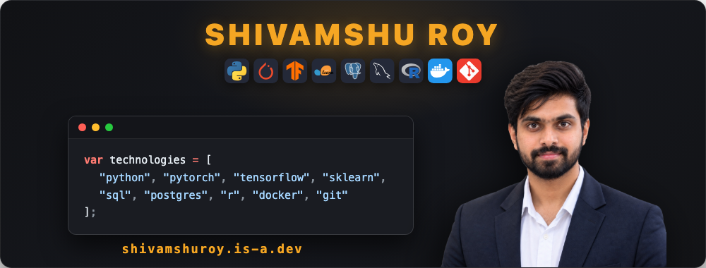

  

  
  
  
  

 

### Overview

* **Academics:** Graduate student at the University at Buffalo focusing on Data Science, statistical modeling, and applied AI.
* **Engineering:** Architecting end-to-end machine learning workflows, browser engines, and full-stack utilities.
* **Writing:** Documenting engineering deep-dives, learning frameworks, and project breakdowns on Medium.

---

### Featured Work

* [**CheckmateLab**](https://github.com/Shivamshuroy448/CheckmateLab)
   In-browser chess engine and game analysis suite powered by Stockfish 16 NNUE.

* [**DS Roulette**](https://github.com/Shivamshuroy448/ds-roulette)
   Interactive Data Science interview preparation wheel featuring 60 curated topics, drill assessments, and automated GitHub study sync.

* [**GreenGrid AI**](https://github.com/Shivamshuroy448/greengridai)
   Dual ML classification system evaluating EV charging demand intensity and station placement.

* [**ClearHire**](https://github.com/Shivamshuroy448/clearhire-app)
   Intelligent job application tracker featuring automated inbox synchronization and status detection.

---

### Publications & Articles

* [**There is an odd sort of guilt that accompanies starting a Master's degree**](https://shivamshuroy.medium.com/there-is-an-odd-sort-of-guilt-that-accompanies-starting-a-masters-degree-429dc7a6bf80)
   How a daily 15-minute GitHub habit changed the way I learn.

* [**I Got Tired of Paying for Chess Subscriptions, So I Built My Own Browser Engine**](https://shivamshuroy.medium.com/i-got-tired-of-paying-for-chess-subscriptions-so-i-built-my-own-browser-engine-923a23a7cc03)
   Building CheckmateLab with Stockfish 16 NNUE.

---

### Activity & Statistics

  
  

  

