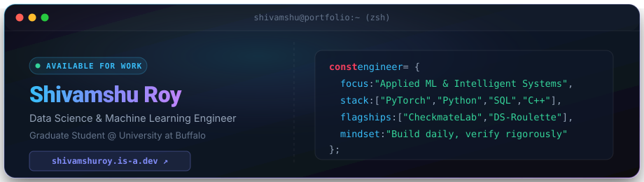

<p align="center">
  <a href="https://shivamshuroy.is-a.dev/" target="_blank">
    
  </a>
</p>

<p align="center">
  <a href="https://shivamshuroy.is-a.dev/" target="_blank">
    
  </a>
  <a href="https://www.linkedin.com/in/shivamshuroy/" target="_blank">
    
  </a>
  <a href="https://shivamshuroy.medium.com/" target="_blank">
    
  </a>
  <a href="https://public.tableau.com/app/profile/shivamshu.roy7243/vizzes" target="_blank">
    
  </a>
  <a href="https://github.com/Shivamshuroy448" target="_blank">
    
  </a>
</p>

<br />

### About Me

```zsh
> shivamshu.bio()
[
  "🎓 Graduate Student in Data Science @ University at Buffalo (SUNY)",
  "⚡ Core Focus: Applied Machine Learning, Intelligent Systems & Full-Stack Tools",
  "♟️ Engineered CheckmateLab: Client-side chess engine powered by Stockfish 16 NNUE",
  "🎲 Built DS Roulette: 60-topic adaptive interview platform with GitHub automated sync",
  "✍️ Writing technical deep dives on Medium about engineering, engines, and research"
]
```

<br />

### Tech Stack & Tooling

<p align="center">
  <a href="https://skillicons.dev">
    
  </a>
</p>
<p align="center">
  <a href="https://skillicons.dev">
    
  </a>
</p>

<br />

### Featured Projects

<table>
  <tr>
    <td width="50%" valign="top">
      <h3 align="left">♟️ <a href="https://github.com/Shivamshuroy448/CheckmateLab">CheckmateLab</a></h3>
      <p>High-performance in-browser chess engine and game analysis suite running Stockfish 16 NNUE via WebAssembly with zero server dependencies.</p>
      <p>
        
        
        
      </p>
    </td>
    <td width="50%" valign="top">
      <h3 align="left">🎲 <a href="https://github.com/Shivamshuroy448/ds-roulette">DS Roulette</a></h3>
      <p>Interactive Data Science interview readiness platform featuring a 60-topic syllabus, drill assessments, and automatic GitHub study commits.</p>
      <p>
        
        
        
      </p>
    </td>
  </tr>
  <tr>
    <td width="50%" valign="top">
      <h3 align="left">⚡ <a href="https://github.com/Shivamshuroy448/greengridai">GreenGrid AI</a></h3>
      <p>Dual machine learning classification system analyzing urban power grids to predict EV charging demand intensity and optimal charging station placement.</p>
      <p>
        
        
      </p>
    </td>
    <td width="50%" valign="top">
      <h3 align="left">💼 <a href="https://github.com/Shivamshuroy448/clearhire-app">ClearHire</a></h3>
      <p>Intelligent career workflow engine providing automated status detection, application tracking, and interview analytics.</p>
      <p>
        
        
      </p>
    </td>
  </tr>
</table>

<br />

### Publications & Writing

* [**There is an odd sort of guilt that accompanies starting a Master's degree**](https://shivamshuroy.medium.com/there-is-an-odd-sort-of-guilt-that-accompanies-starting-a-masters-degree-429dc7a6bf80)
  <br>Reflections on building a daily 15-minute GitHub coding routine and continuous technical growth.

* [**I Got Tired of Paying for Chess Subscriptions, So I Built My Own Browser Engine**](https://shivamshuroy.medium.com/i-got-tired-of-paying-for-chess-subscriptions-so-i-built-my-own-browser-engine-923a23a7cc03)
  <br>Deep dive into architecting CheckmateLab with Stockfish 16 NNUE and WebAssembly client-side execution.

<br />

### Activity & Statistics

<p align="center">
  
  
</p>
<p align="center">
  
</p>
